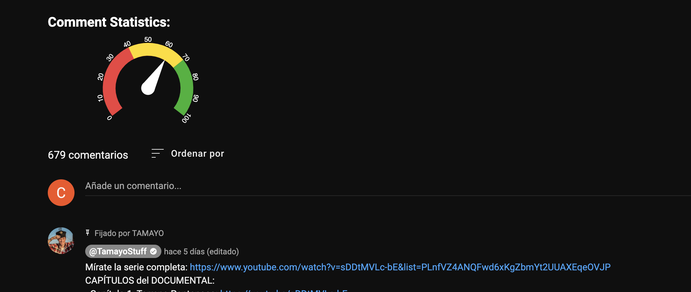

# Youtube comments Mood chrome plugin

<br>
Evaluate the overall moods of the comment using this plugin

## How to use

Because is still in a very alpha version, you should make the following steps to make it work:

Clone and run the project: https://github.com/warguns/comment-statistics

then use [ngrok](https://ngrok.com/) to open the visibility to the internet.

```shell
ngrok http 8080
```

Next, replace the ```apiUrl``` inside the ```background.js``` with the right domain.

Finally inside extensions, enable the developer mode on chrome, click ```load unziped version``` and specify the src 
folder

### Troubleshooting
Is Still very imprecise and faulty so sometimes you will need to refresh the page to see the gauge.

Made by [Warguns](https://github.com/warguns)
